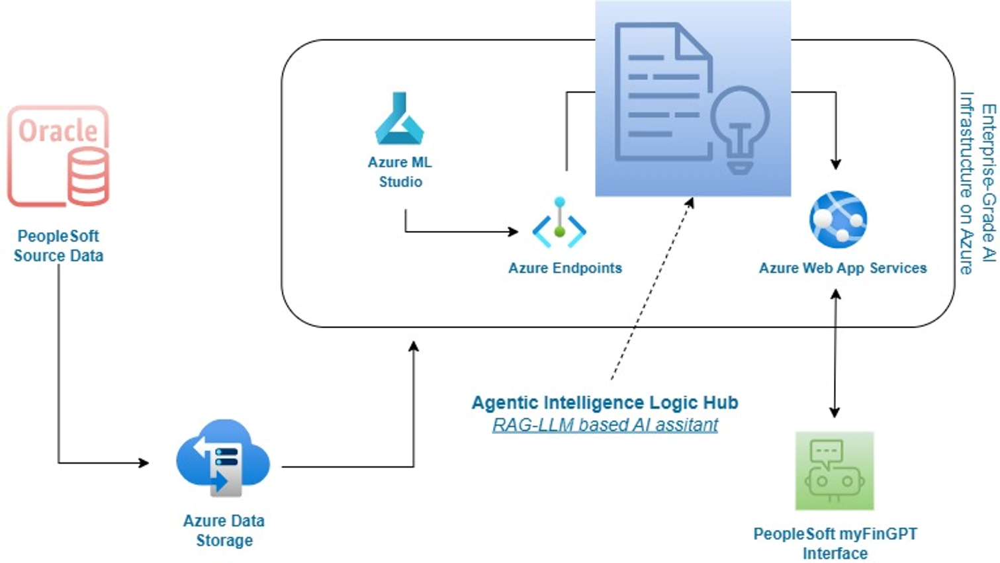

# FinSight — AI-Powered Enterprise Finance Analytics Copilot

> Built during while working at a Fortune 500 real estate & technology firm 

FinSight is a domain-specific AI assistant that lets finance and operations teams query large-scale internal Work Order and Supplier data in plain English — no SQL, no dashboards, no waiting on analysts. Built entirely on internal enterprise data and deployed for real users in production.

---

## The Problem

Work Order and Supplier data was buried in manual SQL queries and static dashboards. Finance teams couldn't self-serve — every data question required an analyst or a developer. The goal was to replace that bottleneck with a conversational AI interface that understood the internal data domain natively and securely.

---

## System Architecture

### High-Level Overview

### End-to-End Data Flow

---

## How It Works

### Pipeline Overview

The system is built across six stages:

**1. Data Preprocessing**
- Exploratory data analysis across large-scale enterprise financial datasets
- Data cleansing, transformation, and synonym matching to normalize domain terminology

**2. Retrieval Strategy Experimentation**
- Evaluated: FAISS-only, BM25-only, TF-IDF, Elasticsearch, Qdrant
- Selected: **Hybrid FAISS + BM25** for best precision across both structured lookups and fuzzy queries

**3. Vector DB & Embedding Generation**
- Transformer-based sentence embeddings over internal finance data
- FAISS index construction for dense vector search
- BM25 token-based index for lexical retrieval
- Dual retrieval alignment for re-ranking

**4. Query Intent Classification**
- Intent detection: lookup / aggregation / explanation
- Dataset selector: routes queries to the appropriate internal data source

**5. Query Handling & LLM Reasoning**
- Hybrid retrieval fusion (FAISS + BM25) for lookup and aggregation queries
- LLM-driven file summarization and explanation for open-ended queries

**6. Frontend UX & Output Formatting**
- ChatGPT-style chat interface
- File upload support
- Natural sentence rendering of financial query results

---

## Solution: FinSight AI Assistant

### Why a Custom Domain-Specific LLM (not a generic API)?

| Approach | Limitation |
|---|---|
| Traditional NLP LLM | Generic training data, lacks domain awareness, requires complex prompts |
| Off-the-shelf LLM API | External, requires context every time, raises enterprise data privacy concerns |
| **Custom Domain-Specific LLM (chosen)** | Trained on internal enterprise data, domain-aware, secure, no context injection needed |

---

## Tech Stack

| Layer | Technology |
|---|---|
| Retrieval | FAISS (dense vector search) + BM25 (lexical) — hybrid fusion |
| Embeddings | Transformer-based sentence embeddings |
| Intent Classification | Custom intent detector (lookup / aggregation / explanation) |
| LLM Reasoning | Domain-specific LLM trained on internal enterprise data |
| Backend API | FastAPI |
| Frontend | React (ChatGPT-style UI, file upload, natural sentence rendering) |
| Visualization | Power BI integration for real-time data visualization |
| Deployment | Docker, Kubernetes, GitHub Actions CI/CD |
| Observability | Prometheus + ELK stack |

---

## Results & Business Impact

- **Reduced dependency on manual SQL** — finance teams query data directly in natural language
- **Faster decision-making** — no analyst bottleneck for routine data questions
- **More accessible finance data** — non-technical stakeholders can self-serve
- **Enterprise-grade privacy** — built entirely on internal data, no external API exposure
- **~200–300ms query latency** in production serving

---

## Key Technical Achievements

- Designed and evaluated 5 retrieval strategies before landing on hybrid FAISS + BM25 as the optimal approach
- Built domain-aware intent classification that routes queries without requiring context injection
- Implemented confidence scoring and governed response guardrails before results reach users
- Integrated real-time BI data visualization into the conversational interface

---

## Demo

> 📹 `demo/finsight_demo.mp4` — screen recording of natural language query → retrieval → response flow

---

## Note on Source Code

This project was built on proprietary enterprise infrastructure and internal datasets. Source code is not publicly available. This repository contains architecture diagrams, a demo recording, and technical documentation only.
